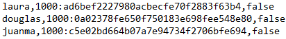

# Security Login

## Integrantes

Juan Martin Garcia

Douglas Lopez

Laura Rubio

## Proceso

Durante el proceso se definieron diferentes métodos que permitan la solución del problema.

| Método | Descripción |
| :--- | :--- |
| createNewUser | Permite la creación de un nuevo usuario dentro del sistemas |
| validateAmountAdmin | Permite conocer si ya existe un usuario tipo adinistrador dentro de la aplicación |
| cerrarSesion | Cierra la sesion de un usuario, almacenando su ultimo acceso dentro de la plataforma |
| validateCredentials | Valida las credenciales de acceso de un usuario |

En el grupo se concluyó que la mejor forma para manejar los usuarios consistía através de archivos de texto. Esto por la facilidad que tienen dentro del lenguaje java y por que todos conociamos el manejo de archivos.

### Seguridad

Para emplear el algoritmo de seguridad sobre las contraseñas, fue necesario realizar una investigación sobre como llevar a cabo la implementación de PBKDF2. Encontramos mucha información relevante que nos permitió definir una clase encargada de realizar la validación de credenciales y el hash de la contraseña.

| Método | Descripción |
| :--- | :--- |
| generatePassword | Permite generar una contraseña segura, basado en la contraseña simple que ingresa el usuario. |
| toHex |  |
| getSalt |  |
| validatePassword | Valida la contraseña debil con la almacenada dentro del archivo de texto. |
| fromHex |  |

### Archivos

Para manejar la información dentro del proyecto definimos 2 archivos:

#### Passwd

El archivo de passwd se encuentra conformado por la información de las credenciales del usuario así: username,password,admin. El ultimo campo permite identificar si el tipo de usuario es admin \(true\) o no \(false\)

#### Accesos

Este archivo nos permite almacenar los ultimos accesos de los usuarios, almacenandolos con formato: username, fecha.

Este archivo se modifica una vez el usuario cierra sesion

## Dificultades

Las principales dificultades que se presentaron al momento de desarrollar el proyecto fue en la implementación del método para almacenar las contraseñas, esto dado a que era nuevo y no lo conociamos. Sin embargo, en internet hay una gran cantidad información sobre el tema, lo que facilito la tarea.

Otra dificultad, pero que requirio menos trabajo, fue la manipulación de los archivos en el lenguaje de java. Hace tiempo no utilizabamos este tipo de métodos, por lo que fue necesario recordar como escribir y leer archivos.

## Conclusiones

Finalmente lo gramos culminar el proyecto cumpliendo las funcionalidades especificadas. Consideramos que el manejo con archivos fue un punto a favor que permitió una implementación más sencilla. Identificamos que un desarrollo seguro toma más tiempo en realizar la implementación y exige una investigación para poder comprender que estrategias o herramientas utilizar, pero es necesario dado a que permite que las aplicaciones sean más seguras y confiables.

#### Documentación



